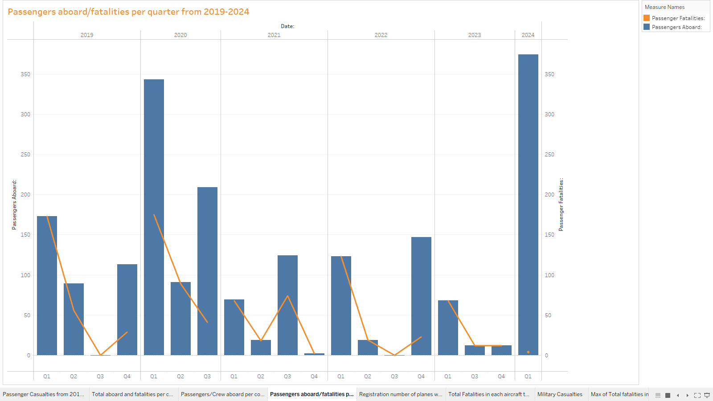

# PLANE CRASH INFORMATION

This data analysis project employs Tableau and MS Excel to investigate and visualize patterns within a diverse dataset of aviation incidents. Initial steps involve gathering and cleaning data, ensuring accuracy and consistency. Temporal trends are explored using both tools, examining patterns over months, quarters and years. Geo-spatial analysis in Tableau helps identify crash hot spots. The ultimate goal is to develop an interactive dashboard(s) in Tableau, providing users with a dynamic platform to explore the data, apply filters and gain insights. The dataset was collected from an external source.

## Screenshots

*Number of passengers died in a crash from 2017-2020.*

*Total number of passengers and crew aboard/fatalities per country.*

*Total number of passengers/crew aboard in each country per operator.*

*Total number of passengers aboard and fatalities per quarter from 2019-2024.*

*Registration number of planes with total casualties.*

*Total fatalities in each aircraft type.*

*Total number of military casualties due to military plane/helicopter crashes.*

*Highest number of fatalities in 1 crash per country.*

*Number of people who had not boarded the plane but died on the ground due to the crash from 2017-2020.*

*Number of crew members died in a crash from 2017-2020.*

*Dashboard 1.*

*Dashboard 2.*

*Dashboard 3.*
